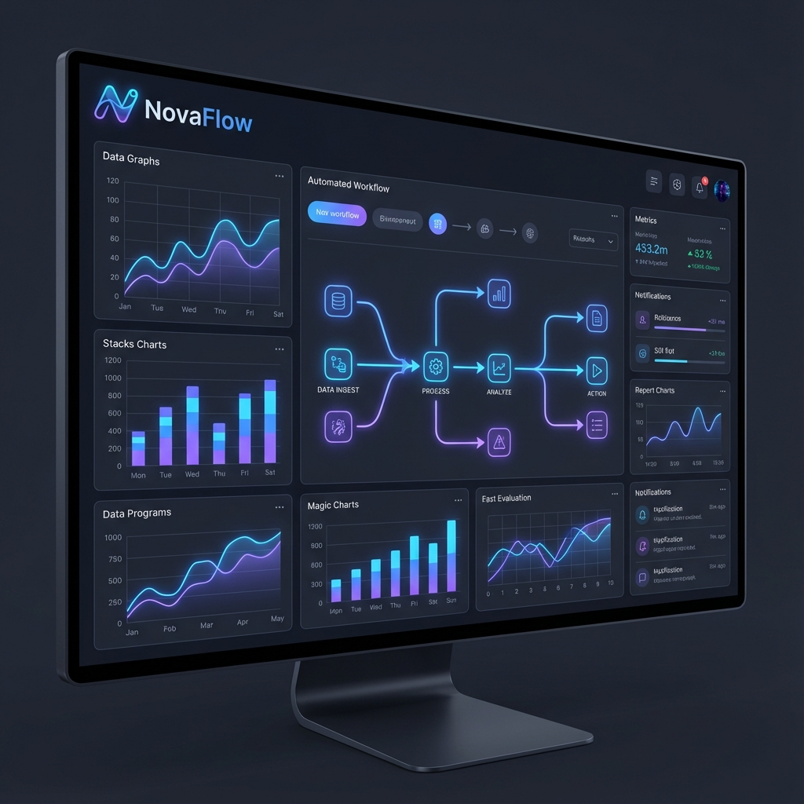

# NovaFlow - Automate Your Work

NovaFlow is a premium, high-performance landing page for a next-generation automation platform. Built with modern web technologies, it features a sleek design, interactive elements, and a responsive layout.



## 🚀 Tech Stack

- **Framework**: [Next.js 15](https://nextjs.org/) (App Router)
- **Styling**: [Tailwind CSS](https://tailwindcss.com/)
- **UI Components**: [Radix UI](https://www.radix-ui.com/) & [Vercel v0](https://v0.dev/)
- **Animations**: [Framer Motion](https://www.framer.com/motion/)
- **Icons**: [Lucide React](https://lucide.dev/)
- **Fonts**: [Geist](https://vercel.com/font)

## ✨ Features

- **Premium Aesthetic**: Glassmorphism effects, subtle gradients, and a refined color palette.
- **Interactive Integrations**: A dynamic section visualizing data flow using animated beams (powered by Framer Motion).
- **Responsive Design**: Fully optimized for mobile, tablet, and desktop devices.
- **Performance**: Optimized images, fonts, and code splitting for fast load times.
- **Modern Components**:
  - **Hero**: Immersive introduction with a 3D-style dashboard visual.
  - **Features**: Grid layout with hover effects and backdrop blur.
  - **Pricing**: Clear, attractive pricing cards with highlighted popular plans.
  - **Testimonials**: Social proof section with key metrics.

## 🛠️ Getting Started

First, install the dependencies:

```bash
npm install
# or
yarn install
# or
pnpm install
```

Then, run the development server:

```bash
npm run dev
# or
yarn dev
# or
pnpm dev
```

Open [http://localhost:3000](http://localhost:3000) with your browser to see the result.

## 🤝 Credits

- Initial component scaffolding provided by **Vercel v0**.
- Design inspiration from modern SaaS landing pages.

## 📄 License

This project is open source and available under the [MIT License](LICENSE).
